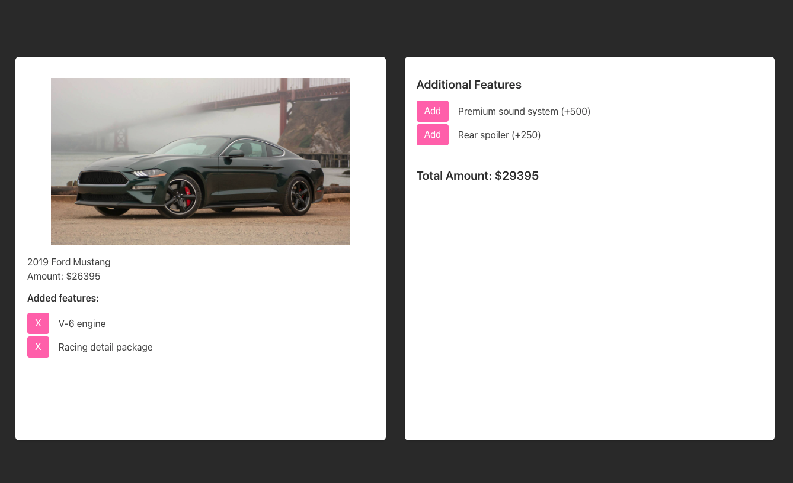

# Customize your car

You have to use REDUX and REDUX toolkit for this project

Create a car store where we can customize the car. Here is demo:


- The left card and right card should be two different components.

[High Res Video](./screenshots/)



## Data
Car Information
```
{
    price: 26395,
    name: "2019 Ford Mustang",
    image: "https://cdn.motor1.com/images/mgl/0AN2V/s1/2019-ford-mustang-bullitt.jpg",
}
```

Features:
```
 { id: 1, name: "V-6 engine", price: 1500 },
 { id: 2, name: "Racing detail package", price: 1500 },
 { id: 3, name: "Premium sound system", price: 500 },
 { id: 4, name: "Rear spoiler", price: 250 }
```
